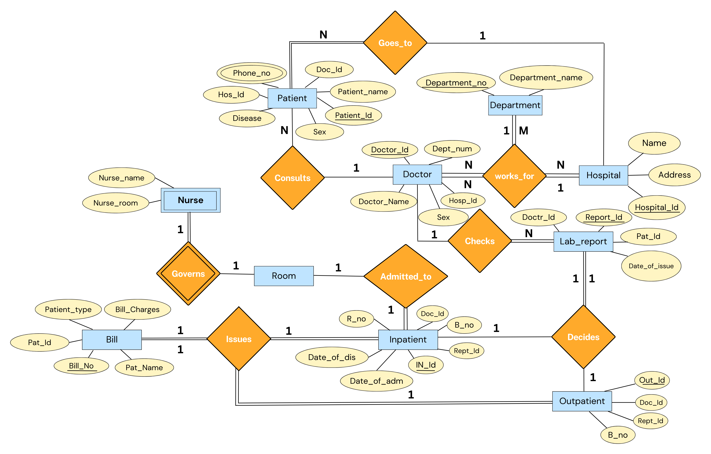

# <p align="center">Hospital Management System</p> 

### <p align="center">IT202 - Database Management Systems Course Project</p>

### Contributors

* Deepanshu Sharma	(2K21/IT/059)
* Chirag Rana 		   (2K21/IT/056)
* Daksh Gupta        (2K21/IT/057)  

## Introduction:

Hospital management involves overseeing and coordinating various aspects of healthcare facilities, including administrative tasks, financial management, resource allocation, staff supervision, and strategic planning. It aims to ensure efficient operations, quality patient care, effective communication, and optimal utilization of resources within a hospital or healthcare organization.


Ultimately, hospital management plays a vital role in achieving organizational goals, enhancing patient satisfaction, and improving overall healthcare outcomes.

<p align ="center">

</p>

## ER Model:

The structure of our database (in the form of an entity - relationship model) consists of:


* **10** entities 
* **8** relationships.

**The entities (11):**


* **Hospital** - Each member of this entity class represents a Hospital name. Multiple Departments and Doctors 'work_for' a single Hospital.
* **Department** - Each member of this entity class refers to a specialized division or unit within the hospital that focuses on providing specific medical services, treatments, or care to patients. Multiple Doctors in our inventory 'works_for' the same Department and multiple Departments 'works_for' the same hospital.  
* **Doctor** - Each member refers to a person who play a vital role in the healthcare system and are responsible for providing medical care to patients in various hospital settings. Multiple Doctors in our inventory 'works_for' same department under same hospital. 
* **Patient** - Each member refers to an individual who is receiving medical care, treatment, or services within the hospital facility. Patients seek hospitalization for various reasons, including illness, injury, surgery, diagnostic procedures, or ongoing medical management.
* **Bill** - Represents the a detailed document or statement that outlines the charges and costs associated with the medical services, treatments, procedures, and other healthcare-related expenses provided to a patient. It serves as a financial record of the services rendered by the hospital and serves as a basis for billing the patient or their insurance provider.
* **Room** - Each member of this entity  refers to a designated space within the hospital facility where patients (particularly Inpatients) are accommodated and receive care during their hospital stay.
* **Inpatient** - Each member corresponds to a category of hospital care where a patient is admitted to and stays within the hospital for a certain period of time to receive medical treatment, monitoring, or surgical procedures. 
* **Outpatient** - Each member corresponds to a category of healthcare services provided to patients in a hospital setting where they do not require overnight admission. Patients who receive outpatient care visit the hospital or clinic for scheduled appointments, procedures, or tests and return home on the same day.
* **Lab_Report** - Each member of this entity play a crucial role in diagnosing medical conditions, monitoring treatment effectiveness, and providing valuable information for healthcare providers to make informed decisions about patient care.
* **Nurse** - Each member of this entity plays a vital role in providing direct patient care, promoting health, preventing illness, and assisting in the overall management of patient well-being within a hospital setting. 

**The relationships (8):**


* **Consults** - Connects products to their respective brands (if they belong to one). We thought of including total participation from products here, but that may create trouble when documenting products that do not actually belong to a brand (or are unbranded). The relation is many-to-one, in the sense that multiple products can belong to the same brand.
* **Goes_to** - Connects products to their respective product categories (if they belong to one). The relation is many-to-one, in the sense that multiple products can fall into the same category.
* **Works_for** - This relation joins members of the Supplier, Product and Invoice entity classes, and is used to represent the overall transfer of inventory from suppliers to our storeroom. We create an invoice to purchase a specific quantity of a particular product at some fixed price from some supplier. All of this is captured through this relation. All invoice members partake in this relation - so there’s total participation.
* **Checks** - This relation joins members of the Customer, Product and Order entity classes, and is used to represent the overall transfer of inventory from our storeroom to customers (consumers & other vendors). A customer places an order to buy a specific quantity of a particular product at some fixed price from our inventory. All of this is captured through this relation. All order members partake in this relation - so there’s total participation.
* **Decides** - This relation joins members of the Customer, Product and Order entity classes, and is used to represent the overall transfer of inventory from our storeroom to customers (consumers & other vendors). A customer places an order to buy a specific quantity of a particular product at some fixed price from our inventory. All of this is captured through this relation. All order members partake in this relation - so there’s total participation.
* **Admitted_to** - This relation joins members of the Customer, Product and Order entity classes, and is used to represent the overall transfer of inventory from our storeroom to customers (consumers & other vendors). A customer places an order to buy a specific quantity of a particular product at some fixed price from our inventory. All of this is captured through this relation. All order members partake in this relation - so there’s total participation.
* **Issues** - This relation joins members of the Customer, Product and Order entity classes, and is used to represent the overall transfer of inventory from our storeroom to customers (consumers & other vendors). A customer places an order to buy a specific quantity of a particular product at some fixed price from our inventory. All of this is captured through this relation. All order members partake in this relation - so there’s total participation.
* **Governs** - This relation joins members of the Customer, Product and Order entity classes, and is used to represent the overall transfer of inventory from our storeroom to customers (consumers & other vendors). A customer places an order to buy a specific quantity of a particular product at some fixed price from our inventory. All of this is captured through this relation. All order members partake in this relation - so there’s total participation.

**The ER Diagram:**

The resulting diagram:

<p align ="center">

</p>

## Relational Model:

A relational model is a way of conceptually representing and managing data in a database by putting it into tables.

Upon converting the previously mentioned Entity - Relationship diagram into a Relational Model, we obtain the following tables:

**Tables constructed from the entities (10):**


1.  Hospital (<span style="text-decoration:underline;">Hospital_Id</span>, Name, Address)
2.  Department (<span style="text-decoration:underline;">Department_no</span>, Department_Name)
3.  Doctor (<span style="text-decoration:underline;">Doctor_Id</span>, Doctor_Name, Sex, Dept_num, Hosp_id)
4.  Patient (<span style="text-decoration:underline;">Patient_Id</span>, Disease, Sex, Patient_name, Doc_Id,Hos_Id) <br>
         4.1. Phone_no(<span style="text-decoration:underline;">Patnt_Id, Patnt_phone</span>) <br>
5.  Bill (<span style="text-decoration:underline;">Bill_no</span>, Bill_Charges, Patient_Type, Pat_Id, Pat_name)
6.  Room (<span style="text-decoration:underline;">Room_no</span>, roomstatus)
7.  Inpatient (<span style="text-decoration:underline;">IN_Id</span>, Doc_Id, R_no, Rept_Id, Date_of_adm, Date_of_dis, B_no)
8.  Outpatient (<span style="text-decoration:underline;">OUT_Id</span>, Rept_Id, Doc_Id, B_no)
9.  Lab_Report (<span style="text-decoration:underline;">Report_Id</span>, Doctr_Id, pat_Id, date_of_Issue)
10. Nurse (<span style="text-decoration:underline;">Nurse_name, nurse_room</span>)


**Tables constructed from the M-N relationships (4):**


1. works_for (<span style="text-decoration:underline;">H_Id, D_no</span>, brand_id)


## Result of mapping the HOSPITAL MANAGEMENT ER schema into a relational database schema :


## Table Constraints:

Constraints set restrictions on how much and what kind of data can be inserted, modified, and deleted from a table. Constraints are used to ensure data integrity during an update, removal, or insert operation on a table.

Below are the constraints that we impose on the constructed tables:

**Constraints on tables constructed from the entities (7):**


1. **Hospital**: This table lists the names of various Hospitals in our inventory along with their Id's and Addresses. The Hospital_Id is the primary key, and clearly, the Name and Address column should never be left empty.

```sql
-- Table storing a list of brands of products.
CREATE TABLE IF NOT EXISTS Hospital (
   brand_id SERIAL PRIMARY KEY,
   brand_name VARCHAR(50) NOT NULL
);
```


2. **Department**: This table lists the various Departments of medicine in our inventory that may or may not be present in every Hospital. The Department_no is the primary key, and the Department_name column should never contain null values (defeats the purpose).

```sql
-- Table storing a list of various product categories.
CREATE TABLE IF NOT EXISTS category (
   category_id SERIAL PRIMARY KEY,
   category_name VARCHAR(50) NOT NULL,
   parent_id INT REFERENCES category(category_id)
);
```


3. **Doctor**: This table lists the various Doctors in our inventory, and also a doctor works for a single Hospital. The Doctor_Id is the primary key, and the other attributes are Doctor_name, Sex, Dept_num(referenced with Department(Department_no)), Hosp_Id(referenced with Hospital(Hospital_Id)).

```sql
-- Table storing details about products in our inventory.
CREATE TABLE IF NOT EXISTS product (
   product_id SERIAL PRIMARY KEY,
   product_name VARCHAR(50) NOT NULL,
   description VARCHAR(200),
   mrp NUMERIC(10, 2) NOT NULL CHECK (mrp > 0),
   selling_price NUMERIC(10, 2) NOT NULL CHECK (
       selling_price > 0 AND
       selling_price <= mrp
   ),
   stock INT NOT NULL DEFAULT 0 CHECK (stock >= 0),
   reserved_stock INT NOT NULL DEFAULT 0 CHECK (reserved_stock >= 0)
);
```


4. **Patient**: This table contains details about Patients, including their name, Disease, Sex, phone number (which has to be a valid phone number - we’ve implemented a CHECK to handle this suitably), Doc_Id(referenced with Department(Department_no)), Hos_Id(referenced with Hospital(Hospital_Id)). Each Patient is assigned a unique id i.e, Patient_Id which is used as the primary key in this table.

```sql
-- Table storing details about our customers.
CREATE TABLE IF NOT EXISTS customer (
   customer_id SERIAL PRIMARY KEY,
   name VARCHAR(50) NOT NULL,
   address VARCHAR(200) NOT NULL,
   contact_number CHAR(10) NOT NULL CHECK (contact_number NOT LIKE '%[^0-9]%'),
   email VARCHAR(30) NOT NULL CHECK (email LIKE '%_@__%.__%')
);
```


5. **Bill**: This table contains details about the patient, including their name, Id and type along with the bill charges. Each Bill is assigned a unique id i.e, Bill_no, which is the primary key here.

```sql
-- Table storing details about our suppliers.
CREATE TABLE IF NOT EXISTS supplier (
   supplier_id SERIAL PRIMARY KEY,
   name VARCHAR(50) NOT NULL,
   address VARCHAR(200) NOT NULL,
   contact_number CHAR(10) NOT NULL CHECK (contact_number NOT LIKE '%[^0-9]%'),
   email VARCHAR(30) NOT NULL CHECK (email LIKE '%_@__%.__%')
);
```


6. **Room**: This table contains details regarding the rooms in the hospital. A unique id is assigned to each room i.e, room_no(the primary key). We also get to know the current status of the room (i.e. whether the room is vacant / occupied). Relevant constraints have been added.

```sql
-- Table storing details about our invoices to suppliers.
CREATE TABLE IF NOT EXISTS invoice (
   invoice_id SERIAL PRIMARY KEY,
   invoice_date TIMESTAMP NOT NULL DEFAULT NOW(),
   quantity INT NOT NULL CHECK (quantity > 0),
   bill_amount NUMERIC(10, 2) NOT NULL CHECK (bill_amount > 0),
   status VARCHAR(50) NOT NULL DEFAULT 'NOT PAID' CHECK (
       status = 'PAID' OR
       status = 'NOT PAID' OR
       status = 'CANCELLED'
   )
);
```

7. **Inpatient**: Similar to the *Patient* table, this table contains details about the Patients that are admitted to the hospital (and stays within the hospital) that includes room number(R_no referenced to Room(Room_no)), Doctor Id(Doc_Id referenced to Doctor(Doctor_Id)), report id(Rept_Id referenced to Lab_Report(Report_Id)), date of admission, date of discharge and Bill no(B_no referenced to Bill(Bill_no)). Each Inpatient is given a unique value (IN_id is the primary key) that is referenced to the Patient_Id. 

```sql
-- Table storing details about our customers' orders.
CREATE TABLE IF NOT EXISTS customer_order (
   order_id SERIAL PRIMARY KEY,
   order_date TIMESTAMP NOT NULL DEFAULT NOW(),
   amount NUMERIC(10, 2) NOT NULL CHECK (amount > 0),
   quantity INT NOT NULL CHECK (quantity > 0),
   status VARCHAR(50) NOT NULL DEFAULT 'NOT PAID' CHECK (
       status = 'PAID' OR
       status = 'NOT PAID' OR
       status = 'CANCELLED'
   )
);
```

8. **Outpatient**: Similar to the *Patient* table, this table contains details about the Patients that are admitted to the hospital (and do not stay within the hospital) that includes Doctor Id(Doc_Id referenced to Doctor(Doctor_Id)), report id(Rept_Id referenced to Lab_Report(Report_Id)) and Bill no(B_no referenced to Bill(Bill_no)). Each Outpatient is given a unique value (OUT_id is the primary key) that is referenced to the Patient_Id. 

```sql
-- Table storing details about our customers' orders.
CREATE TABLE IF NOT EXISTS customer_order (
   order_id SERIAL PRIMARY KEY,
   order_date TIMESTAMP NOT NULL DEFAULT NOW(),
   amount NUMERIC(10, 2) NOT NULL CHECK (amount > 0),
   quantity INT NOT NULL CHECK (quantity > 0),
   status VARCHAR(50) NOT NULL DEFAULT 'NOT PAID' CHECK (
       status = 'PAID' OR
       status = 'NOT PAID' OR
       status = 'CANCELLED'
   )
);
```

9. **Lab_Report**: This table contains details about the medical conditions of the Patient. Each Lab report is given a unique value (Report_Id is the primary key). It also contains the Doctor Id(Doctr_Id referenced to Doctor(Doctor_Id)), Patient Id(pat_Id referenced to Patient(Patient_Id)) and the date of issue of the report.

```sql
-- Table storing details about our customers' orders.
CREATE TABLE IF NOT EXISTS customer_order (
   order_id SERIAL PRIMARY KEY,
   order_date TIMESTAMP NOT NULL DEFAULT NOW(),
   amount NUMERIC(10, 2) NOT NULL CHECK (amount > 0),
   quantity INT NOT NULL CHECK (quantity > 0),
   status VARCHAR(50) NOT NULL DEFAULT 'NOT PAID' CHECK (
       status = 'PAID' OR
       status = 'NOT PAID' OR
       status = 'CANCELLED'
   )
);
```

10. **Nurse**: This table contains details about the Nurse that includes the Name of the nurse and the room she governs. 
```sql
-- Table storing details about our customers' orders.
CREATE TABLE IF NOT EXISTS customer_order (
   order_id SERIAL PRIMARY KEY,
   order_date TIMESTAMP NOT NULL DEFAULT NOW(),
   amount NUMERIC(10, 2) NOT NULL CHECK (amount > 0),
   quantity INT NOT NULL CHECK (quantity > 0),
   status VARCHAR(50) NOT NULL DEFAULT 'NOT PAID' CHECK (
       status = 'PAID' OR
       status = 'NOT PAID' OR
       status = 'CANCELLED'
   )
);
```


**Constraints on tables constructed from the relationships (4):**


1. **works_for**: This table relates Hospitals to their respective Doctors, and contains mappings from H_Id to D_no. Since the relationship is many to many, we make H_Id and D_no together as the primary key and reference them with Hospital(Hospital_Id) and Department(Department_no) respectively. Both attributes are also foreign keys.

```sql
-- Table relating products to their respective brands (if they exist).
CREATE TABLE IF NOT EXISTS product_brand (
   product_id INT PRIMARY KEY REFERENCES product(product_id),
   brand_id INT NOT NULL REFERENCES brand(brand_id)
);
```

